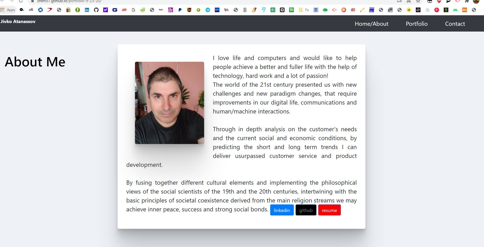
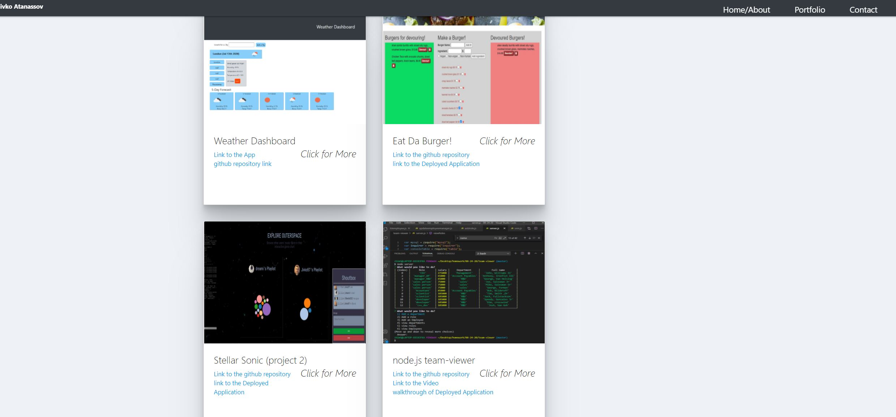

    
# Title : portfolio-9-23-20

## Description
Author: Jivko Atanassov

Updated portfolio site with featured 4 exemplary assignments and projects 1 and 2.

Github User name: zhim57

## Table of Contents:
- [Title](#title)
- [Description](#description)
- [Table of Contents](#table-of-contents)
- [License](#licence)
- [Questions](#questions)

## Installation
It is a static web page no install needed
## Usage

I can be helpful in any industy as a front or back end developer, the website features me and my work .
## Email
zhim57@yahoo.com
## Contributing
All instructors ,colleagues and people I meet. Knoledge and experience can come in all shape and sizes from each human interaction.
## License

## Tests
none

## Questions
please email Jivko Atanassov with any questions at: zhim57@yahoo.com. Thank You.

## Links

[link to this portfolio](https://zhim57.github.io/portfolio-9-23-20/)

[link to the deployed application](https://zhim57.github.io/portfolio-9-23-20/)
  

## Screenshots

  